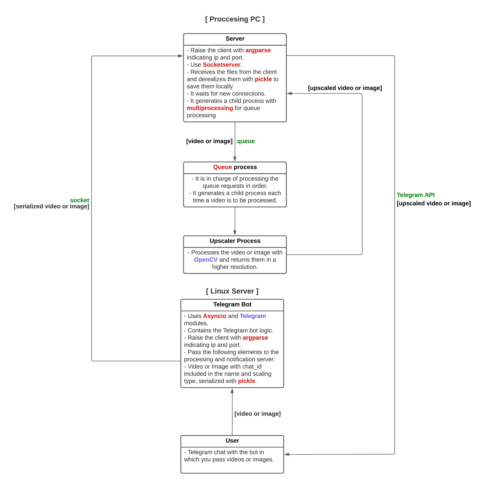

# Pixy Bot

Pixy is a Telegram bot that allows you to increase the quality and size of your images and videos quickly and easily. Just send it an image or video and choose the scaling method you like best: interpolation using the Lanczos method or artificial intelligence with the Real-ESRGAN model. The bot will process your image or video and return it to you with higher resolution and clarity.


## 🎨Diagram and workflow



## ⚡Usage

You can use the bot from here [Pixy](https://t.me/uppy28bot).

- Start the bot by sending the `/start` command to it. This sets the chat ID for sending messages.

- Use the following commands to interact with the bot:

    - `/start`: Set the chat ID so that the bot can send you messages.
    - `/help`: Display the available bot commands.
    - `/scale`: Get information about the available scale methods.
- To upscale an image or video, send the file to the bot. The bot supports the following file types:

    - **Images**: JPEG, PNG, etc.
    - **Videos**: MP4, AVI, etc.

The maximum file size for both images and videos is 20MB.
- When sending an image, you will be prompted to select a upscale method using an inline keyboard. Choose either "Interpolation" or "AI" method.

The bot will upload the file to the server and process it using the selected upscale method.


## 🔧 Dependencies and Installation

- Python >= 3.10
- OpenCV >= 4.5.4
- ffmpeg >= 4.4.2

### Easy Installation

1. Clone the repository

```bash
  git clone https://github.com/Agustinm28/Computacion_2.git
  cd Computacion_2/Final
```

2. Install with setup.py

```bash
  python3 setup.py
```
### Manual Installation

2. Install OpenCV and ffmpeg via apt-get

```bash
  sudo apt-get install python3-opencv
  sudo apt-get install ffmpeg
```

3. Add OpenCV path to `~/.bashrc` file in your home path

```bash
  sudo vim ~/.bashrc
  export PYTHONPATH=/usr/local/lib/python3.10/site-packages:$PYTHONPATH
```

4. Install dependecies 

```bash
  pip install -r requirements.txt
```
## 💻 Deployment

- First of all you must create a new bot through the [BotFather](https://t.me/BotFather) bot in telegram.

- It will return an access token. This must be placed in a `BOT_CREDENTIALS.txt` file in the `data` folder.

- Then, you must get an API Key from the [replicate](https://replicate.com/) page. 

- This API Key must be placed in a `REPLICATE_KEY.txt` file in the `data` folder.

- With all that set up, you can run both the client and the server from the root folder of the bot:

```bash
  python3 pixy_server.py -ip 'IPv4_or_Ipv6' -p 'port'
  python3 pixy_client.py -ip 'IPv4_or_Ipv6_of_server' -p 'port_of_server'
```
## 📖 Documentation

### Real-ESRGAN

The model used to scale images by AI is `Real-ESRGAN`, which is run through `replicate` to avoid the need for powerful hardware locally.

However, if you want to run the scaling AI locally, you can do so by following the steps in the official Real-ESRGAN repository.

▶️ [Real-ESRGAN](https://github.com/xinntao/Real-ESRGAN#-quick-inference): a practical restoration application.

### Pixy Server

Implements a server for receiving and processing files. It uses TCP/IP communication and multiprocessing to handle multiple connections and process files concurrently.

- The ForkedTCPServer4 and ForkedTCPServer6 classes extend the socketserver.TCPServer class and implement a forking server that can handle IPv4 and IPv6 connections, respectively.
- The TCPRequestHandler class extends the socketserver.BaseRequestHandler class and defines the behavior for handling incoming connections. It receives files from clients, saves them locally, and adds them to a queue for processing.
- The process_queue function runs in a separate process and continuously processes files from the queue.
- Each file is processed based on its type (image or video) and scaling method (pixel interpolation or AI).
- Processed files are sent to Telegram users using the modules.telegram_sender module.
- If an error occurs during processing or sending, an appropriate error message is displayed.
- Set up the process server IP and port by running the script with arguments:

    | Parameter | Type     | Description                       |
    | :-------- | :------- | :-------------------------------- |
    | `ip`      | `int` | **Required**. IP address of the process server (default: 127.0.0.1) |
    | `port`      | `int` | **Required**. Port of the process server (default: 5556) |

### Pixy Client

Implements a Telegram bot that can upscale images or videos. It uses the Telegram Bot API and the python-telegram-bot library.

The main execution of the code initializes the Telegram bot with the provided token and sets up various handlers for different commands and message types. It also establishes a connection with a server to send the files for processing. The bot runs in a continuous polling mode to receive and respond to user interactions.

- Set up the server connection IP and port by running the script with arguments:

    | Parameter | Type     | Description                       |
    | :-------- | :------- | :-------------------------------- |
    | `ip`      | `int` | **Required**. IP address of the process server (default: 127.0.0.1) |
    | `port`      | `int` | **Required**. Port of the process server (default: 5556) |


### Upscaler module

This module provides functions for scaling images and videos using pixel interpolation or AI with ESRGAN.

Before using the module, make sure to set the API token as an environment variable. The token should be stored in a file named REPLICATE_KEY.txt in the data folder.

**Functions**:

- `scale_image(filename, scale)`

This function scales an image using pixel interpolation.

| Parameter | Type     | Description                       |
| :-------- | :------- | :-------------------------------- |
| `filename`      | `string` | **Required**. Name of the image file to be scaled|
| `scale`      | `float` | **Required**. The scaling factor |

- `scale_image_ia(filename)`

This function scales an image using AI with ESRGAN.

| Parameter | Type     | Description                       |
| :-------- | :------- | :-------------------------------- |
| `filename`      | `string` | **Required**. Name of the image file to be scaled|

Model parameters:

| Parameter | Type     | Description                       |
| :-------- | :------- | :-------------------------------- |
| `image`      | `string` | **Required**. Image file path|
| `face_enhance`      | `boolean` | **Optional**. Activates facial enhancement|
| `scale`      | `int` | **Required**. Set the scaling factor|

- `scale_video(filename, scale)`

This function scales a video using pixel interpolation.

| Parameter | Type     | Description                       |
| :-------- | :------- | :-------------------------------- |
| `filename`      | `string` | **Required**. Name of the image file to be scaled|
| `scale`      | `float` | **Required**. The scaling factor |

### Compresser module

This module provides functions for compressing videos and images.

**Functions**:

- `compress_video(input_path:str, export_path:str, max_size:int)`

Compresses a video file to reduce its size.

| Parameter | Type     | Description                       |
| :-------- | :------- | :-------------------------------- |
| `input_path`      | `string` | **Required**. The path of the input video file.|
| `export_path`      | `string` | **Required**. The path to save the compressed video file |
| `max_size`      | `int` | **Required**. The maximum size in megabytes (MB) that the compressed video should have |

- `compress_image(export_path:str)`

Compresses an image file to reduce its size.

| Parameter | Type     | Description                       |
| :-------- | :------- | :-------------------------------- |
| `export_path`      | `string` | **Required**. The path of the image file to be compressed.|

### Telegram sender module

This code provides functions for sending messages and files to a user on Telegram using the Telegram API.

**Functions**:

- `send_message(chat_id, message)`

Sends a text message to the specified chat ID.

| Parameter | Type     | Description                       |
| :-------- | :------- | :-------------------------------- |
| `chat_id`      | `int` | **Required**. The ID of the chat where the message will be sent.|
| `message`      | `string` | **Required**. The text message to be sent.|


- `send_file(file_path, filetype, chat_id)`

Sends a file to the specified chat ID.

| Parameter | Type     | Description                       |
| :-------- | :------- | :-------------------------------- |
| `file_path`      | `string` | **Required**. The path of the file to be sent.|
| `filetype`      | `string` | **Required**. The MIME type of the file.|
| `chat_id`      | `int` | **Required**. The ID of the chat where the message will be sent.|

## 🖊️ Author

- [Agustín Montaña](Agustinm28)


